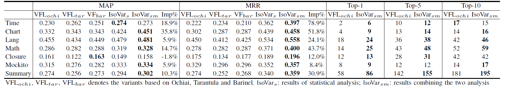
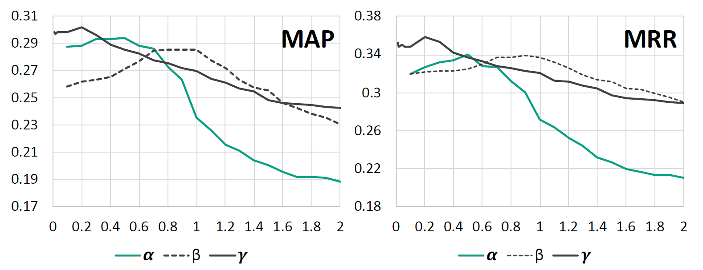
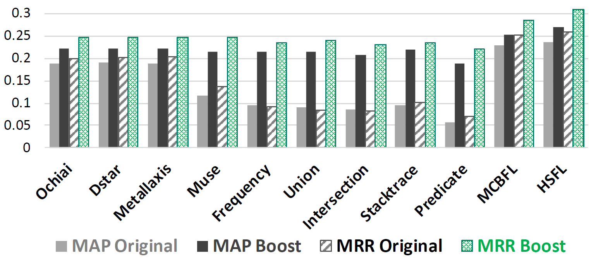
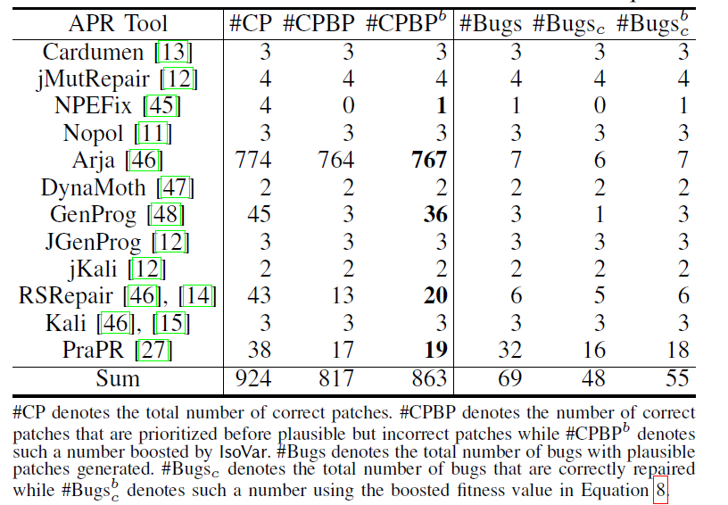

# Results for IsoVar
this repository is raised to show the results of IsoVar

## RQ1 : Effectiveness of IsoVar
Table [1](RQ1.png "The Performance of IsoVar and VFL with respect to Different Metrics") shows the performance of IsoVar on different projects w.r t. different metrics and the according comparisons with VFL.
Specifically, we listed the results of IsoVar obtained
via including only the statistical analysis and including both
the statistical and mutation analysis (i.e., denoted as IsoVars
and IsoVarsm respectively). We also showed the results of
three variants of VFL based on Ochiai, Tarantula and Barinel (we select such three variants since they achieved the optimum performance).

Table 1: The Performance of IsoVar and VFL with respect to Different Metrics

Each VFL based on Ochiai, Tarantula and Barinel as well as IsoVar for each bug can be found at RQ1 folder. For example.

- [Chart_VFL_tarantula.txt](RQ1/Chart_VFL_tarantula.txt) in RQ1/ is the result of tarantula for all the bugs in the Chart
- [Chart_phase#1.txt](RQ1/Chart_phase#1.txt) in RQ1/ is the results of statistical analysis for Chart by IsoVar, 
- [Chart_phase#2.txt](RQ1/Chart_phase#2.txt) in RQ1/ is the results combining the two analysis by IsoVar, below is the first line of the file.

>Chart/Chart_1	[19]	0.05	0.05

The first column represents the bugid, the second column indicates the ranking of each oracle, the remaining two columns represent AP and RR respectively.
There are 3 lines at the bottom of the file, indicating the MAP, MRR and TOP-n of the project.
In addition, 
*******
## RQ2 : Segmenting IsoVar’s Contributions
In this RQ, we investigate the contributions of the statistical analysis and mutation analysis, as well as the impact of those parameters involved in the design of IsoVar (i.e. \alpha, \beta and \gamma in Equation 4,5,6).

Figure 1: Impacts of Different Parameters

Figure [1](alpha_beta_gamma.png "Impacts of Different Parameters") shows the impacts of different parameters on the performance of IsoVar *w.r.t.* MAP and MRR, which reveal that different parameters indeed will cast certain impact on IsoVar’s performance.
All detail data can be found in RQ2 folder, we vary the value of _&alpha;_ from 0 to 2, vary the value of _&beta;_ from 0.1 to 2, vary the value of _&gamma;_ from 0.1 to 2. Then observe the performance of IsoVar *w.r.t.* MAP and MRR.
You can get the MAP and MRR when taking different parameters in the RQ2 folder. For example.

- [Chart_0.1.txt](RQ2/phase#1_alpha/Chart_0.1.txt) in RQ2/phase#1_alpha/ means we take 0.1 as _&alpha;_ and observe performance under this setting.
- [Chart_0.1.txt](RQ2/phase#2_beta/Chart_0.1.txt) in RQ2/phase#2_beta/ means we take 0.1 as _&beta;_ and fix the value of _&alpha;_ and _&gamma;_ to 0.5 to observe the impacts of different _&beta;_.
- [Chart_0.1.txt](RQ2/phase#3_gamma/Chart_0.1.txt) in RQ2/phase#2_gamma/ means we take 0.1 as _&beta;_ and fix the value of alpha value to 0.5, fix the value of beta to 1, then observe the impacts of different _&gamma;_.
***
## RQ3 : RQ3: Usefulness of IsoVar
### Enhancing FL
there are several other families of FL techniques which includes mutation-based, slicing-based, stack trace-based, predicate switchingbased, and hybrid-based techniques. In this RQ, we select a wide range of such FL techniques to investigate whether IsoVar can be incorporated with them to enhance their performance.

we select Ochiai, DStar, Metallaxis, MUSE, Union, Intersection, Frequency, StackTrace, and PredicateSwitching since they are the most representative techniques for each category. Besides, we also select two recent state-of-the-art techniques, a hybrid-technique, MCBFL and a bug-inducing commits driven technique, HSFL. All the 11 techniques are designed to locate faults at the statement level. Figure [2](RQ3_FL.png "Boosting the Performance of FL techniques") shows the average results over 357 bugs in Defects4J *w.r.t.* MAP and MRR.

Figure 2: Boosting the Performance of FL techniques

All detail data can be found in RQ3/FL folder. For example.

- [Chart_dstar.txt](RQ3/FL/origin/Chart_dstar.txt) in RQ3/FL/origin/ means the original results of existing FL techniques (DStar).
- [Chart_dstar.txt](RQ3/FL/BoostedByIsoVar/Chart_dstar.txt) in RQ3/FL/BoostedByIsoVar/ means the boosted results after incorporating the results at the variable level based on Equation 7.
***
### Enhancing APR
The key to overcome the overfitting problem is to enhance the rank of correct patches, and prioritize them over all plausible but incorrect patches.

Table [2](RQ3_APR.png "Prioritize Correct Patches for APR Techniques") shows the results *w.r.t.* the number of correct patches that are ranked in prior to all incorrect ones, and also the number of bugs that can be correctly repaired. We compare the results, for each technique, based on the original ranks generated by the technique, and the new ranking based on the boosted fitness value for each patch as shown in Equation 8. 

Table 2: Prioritize Correct Patches for APR Techniques

 

Detail data can be found in RQ3/APR folder.

- [CorrectPatches.txt](RQ3/APR/CorrectPatches.txt) in RQ3/APR/ folder counts the repairs of different bugs by various tools, there are five columns in the file. The first two columns are bugID and tool's name.
The third column denotes the number of correct patches that are prioritized before plausible but incorrect patches. The forth column denotes such a number boosted by IsoVar. The last two columns refer to the total number of correct and Plausible patches respectively.
- [RankingOfCorrectPatches.txt](RankingOfCorrectPatches.txt) in RQ3/APR/ folder counts the ranking of all correct patches generated by all the selected techniques can be significantly improved from an average rank. The third column denotes the average ranking of correct patches. The forth column denotes such a number boosted by IsoVar.

***
## variable suspicious calculated by IsoVar
All detail data can be found in IsoVar/phase#1 and IsoVar/phase#2 folder. For example.

- [Chart_1.txt](IsoVar/phase#1/Chart/Chart_1.txt) in IsoVar/phase#1/Chart/ contains all suspicious values calculated by IsoVar in phase#1 for variables in Chart_1
- [Chart_1.txt](IsoVar/phase#2/Chart/Chart_1.txt) in IsoVar/phase#2/Chart/ contains all suspicious values calculated by IsoVar in phase#2 for variables in Chart_1, below is the first line of the file.

> org/jfree/data/category/DefaultCategoryDataset	addValue	value	259	0.500805	 

The format of the data is className \t methodName t variableName \t sourceLine \t suspicious (\t oracle)

We also announced the oracle variables we selected. The selection is based on the variables that exist in the line where the fix patch is located. It is worth mentioning that the fix patch often adds some lines to the variable that cannot be found in the corresponding buggy version. We are matching The oracle variable is fuzzy matching based on the index value of the variable in the bytecode or the variable name information.

All oracle variable can be found at IsoVar/Oracle folder. For example.

[Chart_1.txt](IsoVar/Oracle/Chart/Chart_1_Oracle.txt) in IsoVar/Oracle/Chart/ contains all oracle variable for Chart_1.

>org/jfree/chart/renderer/category/AbstractCategoryItemRenderer	1797	1796	dataset	Lorg/jfree/data/category/CategoryDataset;	false	3	false	getLegendItems	()Lorg/jfree/chart/LegendItemCollection;	buggy

The format of the data is className \t sourceLine \t  defineLine t variableName \t variableDesc \t isInStaticMethod \t methodName \t methodDesc \t (In buggy or fixed version)